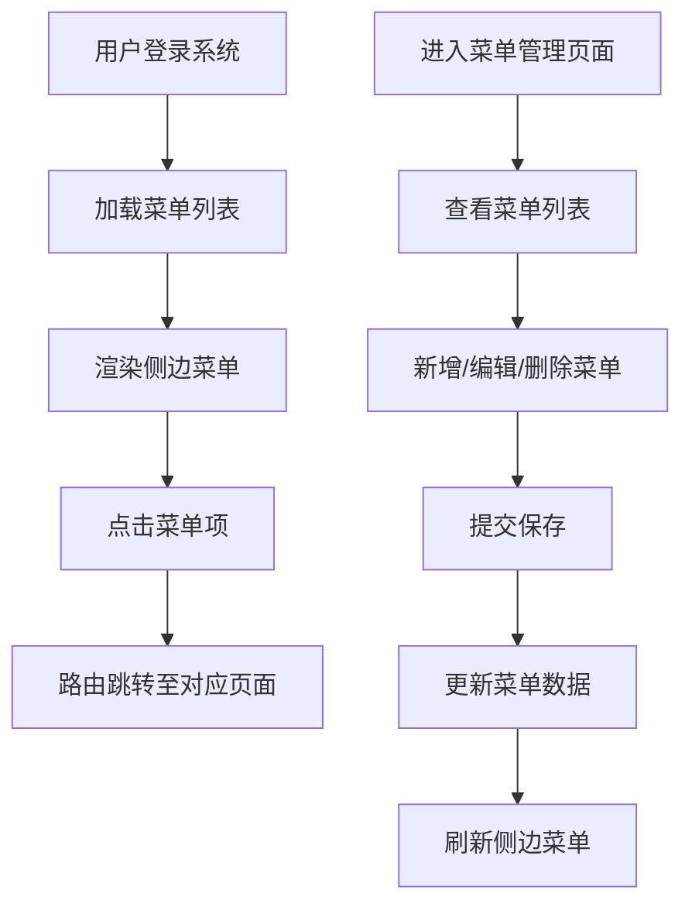

## 1. 产品概述

本项目是一个基于 Vue3 + NestJS + SQLite 的全栈管理系统基础框架，旨在提供一个可扩展的菜单管理系统，为后续功能模块的扩展奠定基础。

- 主要目的：构建一个前后端分离的全栈项目基础框架，实现菜单的动态管理功能
- 目标用户：开发者和系统管理员
- 产品价值：提供可复用的菜单管理基础架构，支持快速扩展新功能模块

## 2. 核心功能

### 2.1 用户角色

| 角色 | 注册方式 | 核心权限 |
|------|----------|----------|
| 管理员 | 系统预置 | 菜单的增删改查、系统配置管理 |

### 2.2 功能模块

1. **主页面**：顶部导航栏、侧边菜单、主内容区域
2. **菜单管理页面**：菜单列表展示、新增菜单、编辑菜单、删除菜单

### 2.3 页面详情

| 页面名称 | 模块名称 | 功能描述 |
|----------|----------|----------|
| 主页面 | 侧边菜单 | 动态渲染菜单列表，支持多层级菜单展开收起 |
| 主页面 | 顶部导航 | 显示系统标题、用户信息 |
| 菜单管理 | 菜单列表 | 表格展示所有菜单，支持分页、搜索 |
| 菜单管理 | 新增/编辑菜单 | 表单录入菜单信息（名称、路径、图标、排序、父级菜单等） |
| 菜单管理 | 删除菜单 | 删除选中菜单，支持批量删除 |

## 3. 核心流程

用户进入系统后，侧边栏动态加载菜单列表。用户可以通过菜单管理功能对菜单进行增删改查操作，操作后菜单列表实时更新。

## 4. 用户界面设计

### 4.1 设计风格

- 主色调：深蓝色 (#165DFF)，代表专业和可信赖
- 辅助色：浅灰背景 (#F5F7FA)，白色卡片 (#FFFFFF)
- 按钮风格：圆角 4px，主按钮蓝色填充，次按钮白色边框
- 字体：系统默认 sans-serif 字体，标题 16px 加粗，正文 14px
- 布局风格：左侧固定侧边栏 + 顶部导航 + 右侧内容区域，卡片式布局
- 图标风格：简洁线性图标

### 4.2 页面设计概述

| 页面名称 | 模块名称 | UI 元素 |
|----------|----------|----------|
| 主页面 | 侧边菜单 | 蓝色选中状态、展开收起动画、图标 + 文字 |
| 主页面 | 顶部导航 | 系统标题、面包屑、用户头像 |
| 菜单管理 | 菜单列表 | 表格、操作按钮（编辑/删除）、新增按钮 |
| 菜单管理 | 表单弹窗 | 输入框、下拉选择、图标选择、排序输入、提交/取消按钮 |

### 4.3 响应式

- 桌面端优先设计，侧边栏宽度 240px
- 移动端侧边栏可折叠为图标模式或隐藏
- 表格在小屏幕下支持横向滚动

### 4.4 交互效果

- 菜单展开收起有平滑过渡动画
- 按钮悬停有颜色变化和阴影效果
- 表格行悬停有背景色变化
- 弹窗出现有淡入和缩放动画
