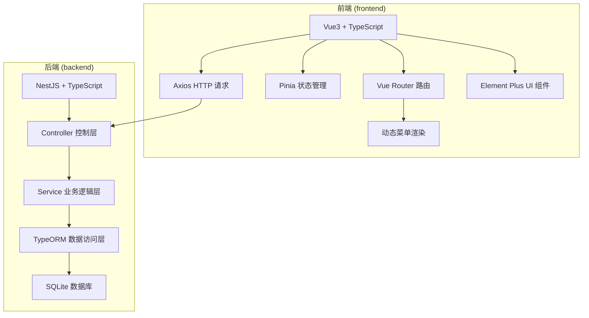
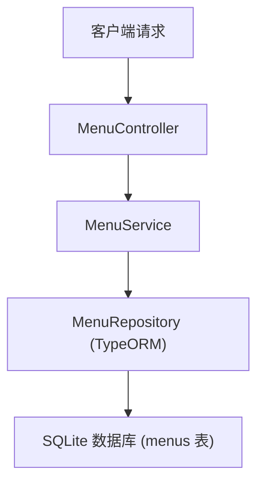
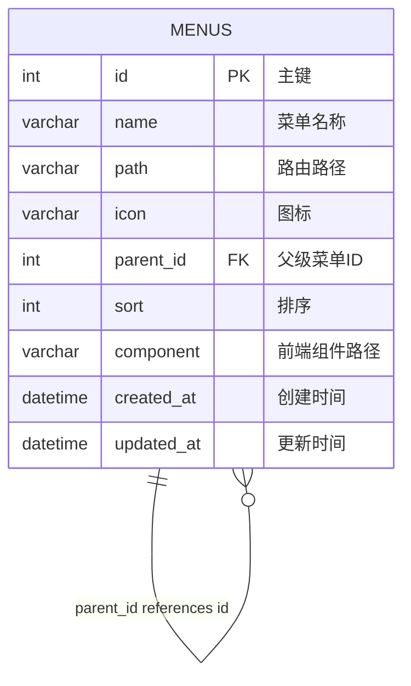

## 1. 架构设计



## 2. 技术描述

- 前端：Vue3 + TypeScript + Vite + Vue Router + Pinia + Element Plus + Axios
- 后端：NestJS + TypeScript + TypeORM + SQLite
- 数据库：SQLite（本地文件数据库）
- 项目结构：前端代码存放在 `frontend` 文件夹，后端代码存放在 `backend` 文件夹

## 3. 路由定义

| 路由路径 | 页面名称 | 说明 |
|----------|----------|------|
| / | 首页 | 系统默认首页 |
| /menu | 菜单管理 | 菜单的增删改查页面 |
| * | 404 页面 | 路由不存在时的 fallback |

## 4. API 定义

### 4.1 菜单相关接口

```typescript
// 菜单实体类型
interface Menu {
  id: number;
  name: string;
  path: string;
  icon: string;
  parentId: number | null;
  sort: number;
  component: string;
  createdAt: Date;
  updatedAt: Date;
  children?: Menu[];
}

// 创建菜单请求
interface CreateMenuDto {
  name: string;
  path: string;
  icon: string;
  parentId?: number | null;
  sort?: number;
  component: string;
}

// 更新菜单请求
interface UpdateMenuDto extends Partial<CreateMenuDto> {
  id: number;
}
```

| 方法 | 路径 | 描述 | 请求参数 | 返回值 |
|------|------|------|----------|--------|
| GET | /menu | 获取菜单列表（树形结构） | 无 | Menu[] |
| GET | /menu/:id | 获取单个菜单详情 | id: number | Menu |
| POST | /menu | 创建菜单 | CreateMenuDto | Menu |
| PATCH | /menu/:id | 更新菜单 | id: number, UpdateMenuDto | Menu |
| DELETE | /menu/:id | 删除菜单 | id: number | void |

## 5. 后端架构图



## 6. 数据模型

### 6.1 数据模型定义



### 6.2 数据定义语言

```sql
-- 菜单表
CREATE TABLE menus (
  id INTEGER PRIMARY KEY AUTOINCREMENT,
  name VARCHAR(100) NOT NULL,
  path VARCHAR(200) NOT NULL,
  icon VARCHAR(50),
  parent_id INTEGER,
  sort INTEGER DEFAULT 0,
  component VARCHAR(200),
  created_at DATETIME DEFAULT CURRENT_TIMESTAMP,
  updated_at DATETIME DEFAULT CURRENT_TIMESTAMP,
  FOREIGN KEY (parent_id) REFERENCES menus(id) ON DELETE CASCADE
);

-- 初始化菜单数据
INSERT INTO menus (name, path, icon, parent_id, sort, component) VALUES
('首页', '/', 'Home', NULL, 1, 'views/Home.vue'),
('系统管理', '/system', 'Setting', NULL, 2, NULL),
('菜单管理', '/system/menu', 'Menu', 2, 1, 'views/Menu.vue');
```

## 7. 目录结构

```
tool_project/
├── frontend/                # 前端 Vue3 项目
│   ├── src/
│   │   ├── api/             # API 接口
│   │   ├── components/      # 公共组件
│   │   ├── composables/     # 组合式函数
│   │   ├── layouts/         # 布局组件
│   │   ├── router/          # 路由配置
│   │   ├── stores/          # Pinia 状态管理
│   │   ├── views/           # 页面组件
│   │   ├── utils/           # 工具函数
│   │   └── main.ts          # 入口文件
│   ├── public/
│   ├── index.html
│   ├── package.json
│   ├── vite.config.ts
│   └── tsconfig.json
├── backend/                 # 后端 NestJS 项目
│   ├── src/
│   │   ├── menu/            # 菜单模块
│   │   │   ├── menu.controller.ts
│   │   │   ├── menu.service.ts
│   │   │   ├── menu.entity.ts
│   │   │   ├── menu.module.ts
│   │   │   └── dto/
│   │   ├── app.module.ts
│   │   └── main.ts          # 入口文件
│   ├── data/                # SQLite 数据库文件目录
│   ├── package.json
│   ├── tsconfig.json
│   └── nest-cli.json
└── README.md
```
